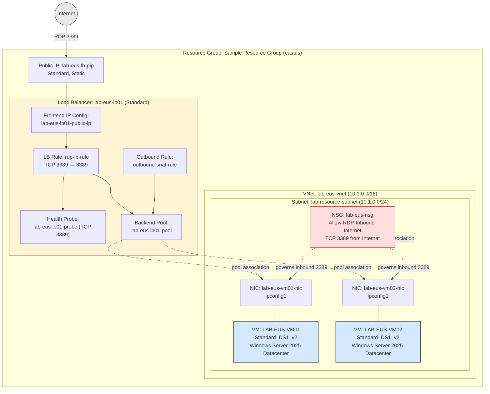

```mermaid
flowchart TB
    Internet((Internet))

    subgraph RG["Resource Group: Sample Resource Group (eastus)"]
        subgraph VNET["VNet: lab-eus-vnet (10.1.0.0/16)"]
            subgraph SUBNET["Subnet: lab-resource-subnet (10.1.0.0/24)"]
                NSG["NSG: lab-eus-nsg<br/>Allow-RDP-Inbound-Internet<br/>TCP 3389 from Internet"]
                NIC1["NIC: lab-eus-vm01-nic<br/>ipconfig1"]
                NIC2["NIC: lab-eus-vm02-nic<br/>ipconfig1"]
                VM1["VM: LAB-EUS-VM01<br/>Standard_DS1_v2<br/>Windows Server 2025 Datacenter"]
                VM2["VM: LAB-EUS-VM02<br/>Standard_DS1_v2<br/>Windows Server 2025 Datacenter"]
            end
        end

        PIP["Public IP: lab-eus-lb-pip<br/>Standard, Static"]

        subgraph LB["Load Balancer: lab-eus-lb01 (Standard)"]
            FE["Frontend IP Config:<br/>lab-eus-lb01-public-ip"]
            RULE["LB Rule: rdp-lb-rule<br/>TCP 3389 → 3389"]
            PROBE["Health Probe:<br/>lab-eus-lb01-probe (TCP 3389)"]
            POOL["Backend Pool:<br/>lab-eus-lb01-pool"]
            OUT["Outbound Rule:<br/>outbound-snat-rule"]
        end
    end

    Internet -->|RDP 3389| PIP
    PIP --- FE
    FE --> RULE
    RULE --> PROBE
    RULE --> POOL
    OUT --> POOL

    POOL -.->|pool association| NIC1
    POOL -.->|pool association| NIC2

    NIC1 --- VM1
    NIC2 --- VM2

    SUBNET -.->|NSG association| NSG
    NSG -.->|governs inbound 3389| NIC1
    NSG -.->|governs inbound 3389| NIC2

    style Internet fill:#e8e8e8,stroke:#333
    style NSG fill:#ffdddd,stroke:#c00
    style VM1 fill:#d4e8ff,stroke:#333
    style VM2 fill:#d4e8ff,stroke:#333
    style LB fill:#fff4d4,stroke:#333
```
