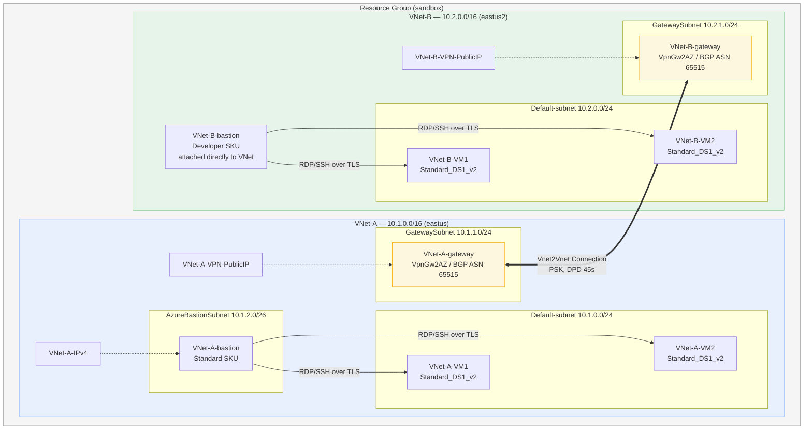

```mermaid
graph TB
    subgraph RG["Resource Group (sandbox)"]
        subgraph VNETA["VNet-A — 10.1.0.0/16 (eastus)"]
            subgraph SUBA_DEF["Default-subnet 10.1.0.0/24"]
                VMA1[VNet-A-VM1<br/>Standard_DS1_v2]
                VMA2[VNet-A-VM2<br/>Standard_DS1_v2]
            end
            subgraph SUBA_GW["GatewaySubnet 10.1.1.0/24"]
                GWA[VNet-A-gateway<br/>VpnGw2AZ / BGP ASN 65515]
            end
            subgraph SUBA_BAS["AzureBastionSubnet 10.1.2.0/26"]
                BASA[VNet-A-bastion<br/>Standard SKU]
            end
            PIPA_VPN[VNet-A-VPN-PublicIP]
            PIPA_BAS[VNet-A-IPv4]
        end

        subgraph VNETB["VNet-B — 10.2.0.0/16 (eastus2)"]
            subgraph SUBB_DEF["Default-subnet 10.2.0.0/24"]
                VMB1[VNet-B-VM1<br/>Standard_DS1_v2]
                VMB2[VNet-B-VM2<br/>Standard_DS1_v2]
            end
            subgraph SUBB_GW["GatewaySubnet 10.2.1.0/24"]
                GWB[VNet-B-gateway<br/>VpnGw2AZ / BGP ASN 65515]
            end
            BASB[VNet-B-bastion<br/>Developer SKU<br/>attached directly to VNet]
            PIPB_VPN[VNet-B-VPN-PublicIP]
        end
    end

    %% VM to subnet NIC attachments
    VMA1 --- SUBA_DEF
    VMA2 --- SUBA_DEF
    VMB1 --- SUBB_DEF
    VMB2 --- SUBB_DEF

    %% Bastion connectivity
    BASA -->|RDP/SSH over TLS| VMA1
    BASA -->|RDP/SSH over TLS| VMA2
    BASB -->|RDP/SSH over TLS| VMB1
    BASB -->|RDP/SSH over TLS| VMB2
    PIPA_BAS -.-> BASA

    %% Gateway public IPs
    PIPA_VPN -.-> GWA
    PIPB_VPN -.-> GWB

    %% Site-to-Site VNet-to-VNet VPN connection
    GWA <==>|Vnet2Vnet Connection<br/>PSK, DPD 45s| GWB

    style RG fill:#f5f5f5,stroke:#999
    style VNETA fill:#e8f0fe,stroke:#4285f4
    style VNETB fill:#e6f4ea,stroke:#34a853
    style GWA fill:#fef7e0,stroke:#f9ab00
    style GWB fill:#fef7e0,stroke:#f9ab00
```
